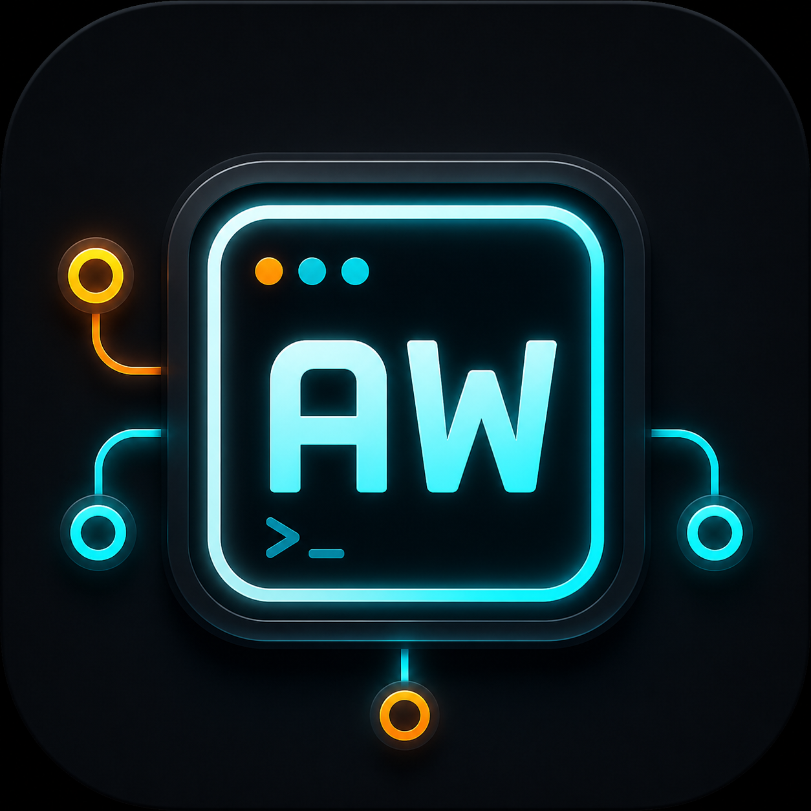
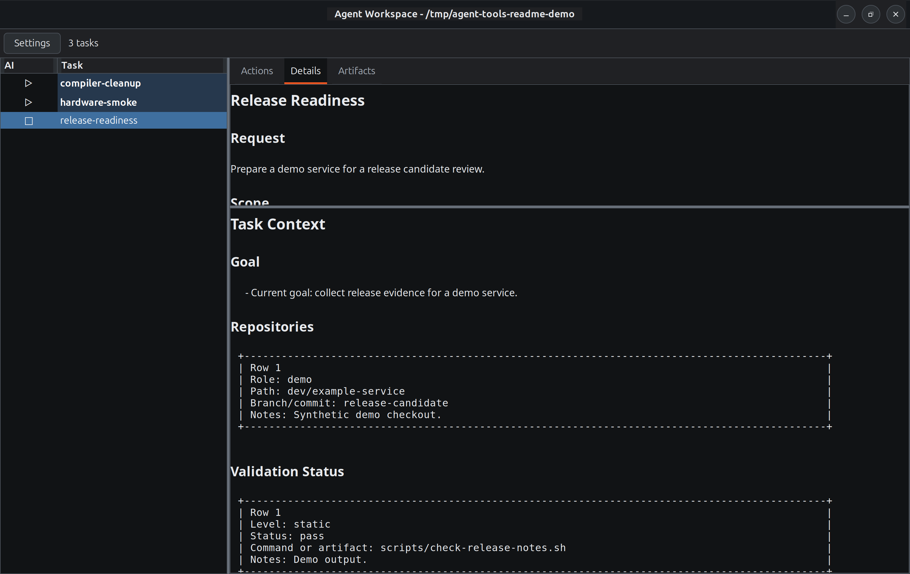
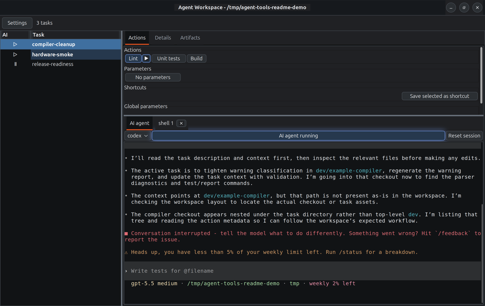
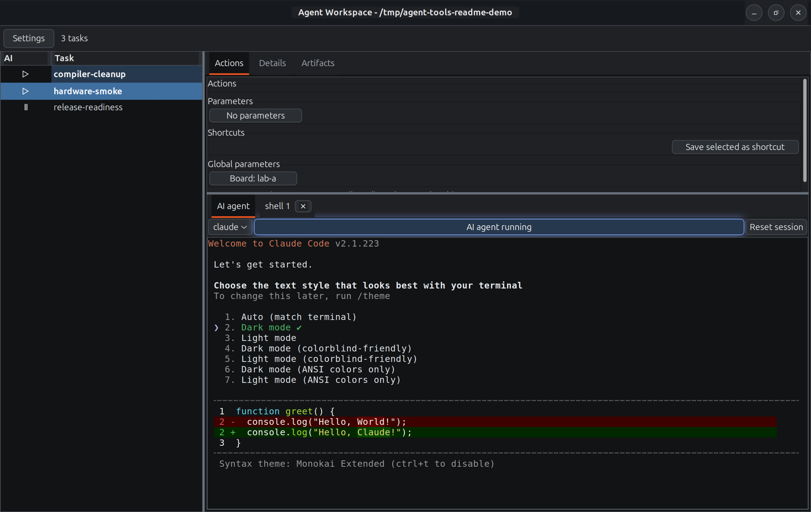

<p align="center">
  
</p>

<h1 align="center">Agent Workspace Tools</h1>

<p align="center">
  A local engineering workspace for human-led AI agent collaboration.
</p>

Agent Workspace Tools is built for a human-in-the-loop workflow where the
developer keeps product judgment and final control, while the agent accelerates
investigation, implementation, refactoring, validation, and routine repository
work.

The core idea is simple: do not rely on the model alone to remember the whole
engineering process. Put the process into the workspace. Tasks, rules, actions,
validation gates, reusable environments, and knowledge files give the agent a
clear operating model and give the human a repeatable way to steer the work.

## What Problem This Solves

AI coding sessions are easy to start and hard to keep disciplined. Context gets
buried in chat history, commands disappear into terminal scrollback, validation
evidence is hard to hand off, and the next agent often has to rediscover the
same facts.

Agent Workspace Tools turns that loose interaction into a structured local
workflow:

- every unit of work has a task directory with durable context;
- repeated commands are exposed as task actions instead of ad hoc shell text;
- validations produce receipts that can be enforced before push;
- reusable Docker/PAF environments make builds and tests reproducible;
- public and private knowledge are separated;
- rules and skills tell agents how to work in the repository.

This keeps the feedback loop short without making the agent unbounded or
opaque.

## Getting Started

Launch the workspace dashboard from the repository root:

```sh
./agent-workspace
```

The usual flow is:

1. Create a task and give it a name.
2. Open Codex, Claude Code, or a shell session from that task.
3. Describe the work in the AI window.
4. Let the agent create or update the task description, context, scripts,
   actions, and validation notes as the work becomes concrete.
5. Use the GUI to run known actions, switch terminals, inspect context, and
   open artifacts while the agent handles the engineering work.
6. Review the result, run validation, and commit when the repository is ready.

### Create A Task

A task is the working unit. Use one task for one investigation, feature,
refactor, bug fix, review, or release activity.

From the GUI, create a task and choose whether it is public or private. Public
tasks are safe to use as examples or mergeable metadata. Private tasks are for
local work that may contain customer details, private paths, credentials in
logs, or personal notes.

Each task gets a predictable layout:

```text
tasks/<task-name>/
  TASK_DESCRIPTION.md   The request, scope, acceptance criteria, useful links.
  TASK_CONTEXT.md       Current state, decisions, repositories, validation.
  dev/                  Checkouts, reproducers, generated build inputs.
  scripts/              Repeatable helper commands.
  report/               Logs, diagrams, reviews, validation evidence.
```

`TASK_DESCRIPTION.md` is the stable brief. In normal use, you describe the
task to the agent and ask it to capture the goal, boundaries, and acceptance
criteria there.

`TASK_CONTEXT.md` is the working handoff. The agent should keep it short but
current: active branch, important decisions, blockers, validation status, and
the next useful step. This is the file a fresh agent session reads to avoid
starting from zero.

### Add Actions

Actions are commands worth turning into buttons: builds, tests, flash/copy
steps, report generation, cleanup, board access, smoke checks, or any command
you expect to run repeatedly during the task.

Usually, you ask the agent to add an action when a command becomes part of the
workflow:

```text
Add a task action for running the unit tests.
```

The agent can create the script if needed and declare the action in
`TASK_ACTIONS.json`:

```json
{
  "actions": [
    {
      "id": "unit-tests",
      "label": "Unit tests",
      "command": ["scripts/run-unit-tests.sh"],
      "cwd": "."
    }
  ]
}
```

Keep actions at the level a human would actually click. A good action is
`Build image` or `Run smoke test`; a poor action is a tiny internal helper that
only exists because one agent needed it once.

### Add Parameters

Use parameters when the same action needs small variations: target board,
build profile, image path, test filter, report name, or deployment target.

In normal use, describe the variation to the agent:

```text
Make the build action accept board and profile parameters.
```

The resulting action metadata can look like this:

```json
{
  "id": "build-image",
  "label": "Build image",
  "command": ["scripts/build-image.sh", "--board", "{board}", "--profile", "{profile}"],
  "parameters": [
    {"name": "board", "label": "Board", "default": "lab-a"},
    {"name": "profile", "label": "Profile", "default": "debug"}
  ]
}
```

Use global parameters for values shared by several actions, such as `board`,
`device`, or `build_dir`. Save parameter sets or shortcuts for combinations
you use often, for example `Board: lab-a` plus `Profile: debug`.

### Work With The AI Window

The AI terminal is for judgment-heavy work: reading code, explaining tradeoffs,
investigating failures, planning a refactor, making edits, reviewing diffs,
and deciding which validation matters.

The GUI is for operating the workspace: selecting the task, opening context,
running known actions, switching between Codex/Claude/shell, saving shortcuts,
and opening artifacts.

A practical session usually looks like this:

1. Select a task in the GUI.
2. Start an AI agent from the task.
3. Tell the agent what you want changed or investigated.
4. Let the agent read or create `TASK_DESCRIPTION.md` and `TASK_CONTEXT.md`.
5. Ask the agent to add useful task actions when repeated commands appear.
6. Use action buttons for known commands instead of retyping them in chat.
7. Ask the agent to update context when it discovers something that should
   survive the current session.
8. Run validation and review the result before committing.

The split is intentional. The agent should reason about the work. The GUI
should make the repeated mechanics cheap and visible.

## The Desktop Workspace

The desktop app is the fastest way to operate the workspace day to day:

```sh
./agent-workspace
```

Agent Workspace lists tasks, shows descriptions and active context, opens task
artifacts, manages per-task terminals, and launches interactive AI sessions
with the selected task context. It is agent-neutral by design: Codex, Claude
Code, shell sessions, and task commands all live in the same workspace model.

The GUI keeps the human close to the real task state: source directories,
reports, validation results, terminals, and actions are visible in one place.

Detailed GUI documentation lives in
[agent_tools/tools/agent_workspace/README.md](agent_tools/tools/agent_workspace/README.md).

## Guardrails, Not Just Prompts

The workspace treats important process rules as enforceable tooling:

- `task_check` validates task structure and workflow metadata.
- `code_map`, `cpp_code_map`, and `yaml_map` help inspect and edit source with
  structural awareness.
- `validate` records validation receipts for changed files or tasks.
- `push_guard` blocks pushes that lack a successful validation marker for the
  exact commit being pushed.
- `commit_msg` formats and checks commit messages and trailers.

The agent can still reason about what needs to be done, but the repository can
technically reject skipped validation, risky staged files, malformed commit
messages, private paths, large generated artifacts, and obvious secret leaks.

This is the difference between "please remember to validate" and "the workflow
will not let this push through without validation."

Tool documentation starts at [agent_tools/tools/README.md](agent_tools/tools/README.md).
Commit and push policy is documented in
[agent_tools/rules/git-commits.md](agent_tools/rules/git-commits.md).

## Reports And Reviews

You can also ask the agent to explain work as a report instead of only
answering in chat. For example:

```text
Prepare a report that explains the investigation results.
```

or:

```text
Summarize the validation run as a report with links to the logs.
```

For code changes, you can ask for a review-oriented diff report:

```text
Review this branch and generate a report I can read later.
```

General reports live under the task's `report/` directory: notes, summaries,
logs, diagrams, validation evidence, and other artifacts worth keeping. Diff
reviews live under `report/diff/` and can use the workspace diff-report
workflow to produce GitHub-style HTML with inline comments tied to files.

This is useful when the answer is too large for chat, when you want to compare
several artifacts side by side, or when the result should survive the current
agent session.

## Reusable Environments

Many real engineering tasks cannot be validated with a host-side command. They
need a known Ubuntu image, CI-compatible dependencies, a Yocto or Zephyr build
environment, a QEMU/Xen runtime harness, or a local reproduction of a GitHub
Actions workflow.

Agent Tools keeps those repeatable environments under `agent_tools/paf_workspace/`.
PAF scenarios can prepare Docker images, mount the workspace at known paths,
run multi-stage builds or tests, collect artifacts, and mark the target
repository as validated for `push_guard`.

The result is a validation path that an agent can run, a human can inspect, and
another machine can reproduce.

See [agent_tools/paf_workspace/README.md](agent_tools/paf_workspace/README.md)
and
[agent_tools/paf_workspace/domains/environments/README.md](agent_tools/paf_workspace/domains/environments/README.md).

## Knowledge And Skills

Agent Tools separates durable knowledge from transient task notes.

`agent_tools/knowledge/` stores findings that should help future work:
repeated failure patterns, environment gotchas, diagnostic checklists, and
topic-specific lessons. Public knowledge is commit-ready only when it contains
no private data. Private knowledge stays in ignored local storage.

`agent_tools/skills/` contains agent-facing workflow wrappers. A skill does
not implement the tool; it points the agent to the checked-in tool, rule, or
PAF scenario that should be used for a class of tasks. This reduces repeated
reasoning without stuffing every prompt with all possible instructions.

See [agent_tools/knowledge/README.md](agent_tools/knowledge/README.md) and
[agent_tools/rules/workspace-skills.md](agent_tools/rules/workspace-skills.md).

## Privacy Model

The repository describes mechanisms, not private values.

Task directories are local workspace state and should not be merged into the
public tool repository. Public rules, examples, tests, knowledge, and reports
must avoid personal identities, email addresses, account mappings, customer
details, tokens, secrets, and private project data.

When a workflow needs local identity routing or private configuration, it
belongs in local Git config, environment variables, or ignored private files.
The public toolset should remain reusable by other people.

## Screenshots

Agent Workspace with task context, action buttons, and live agent terminals:







## Repository Structure

```text
AGENTS.md       Workspace-level instructions for AI agents.
agent-workspace Desktop dashboard launcher.
agent_tools/    Reusable tools, rules, skills, knowledge, and PAF assets.
tasks/          Local task directories, ignored except layout placeholders.
report/         Workspace-level generated reports and validation receipts.
```

## Why It Matters

Agent Tools is not trying to hide engineering complexity behind a chat box. It
keeps the complexity visible, named, and runnable. The human sees the task, the
agent sees the same task, and the repository enforces the checks that matter.

That makes AI assistance less dependent on a perfect prompt and more dependent
on a repeatable engineering system.
